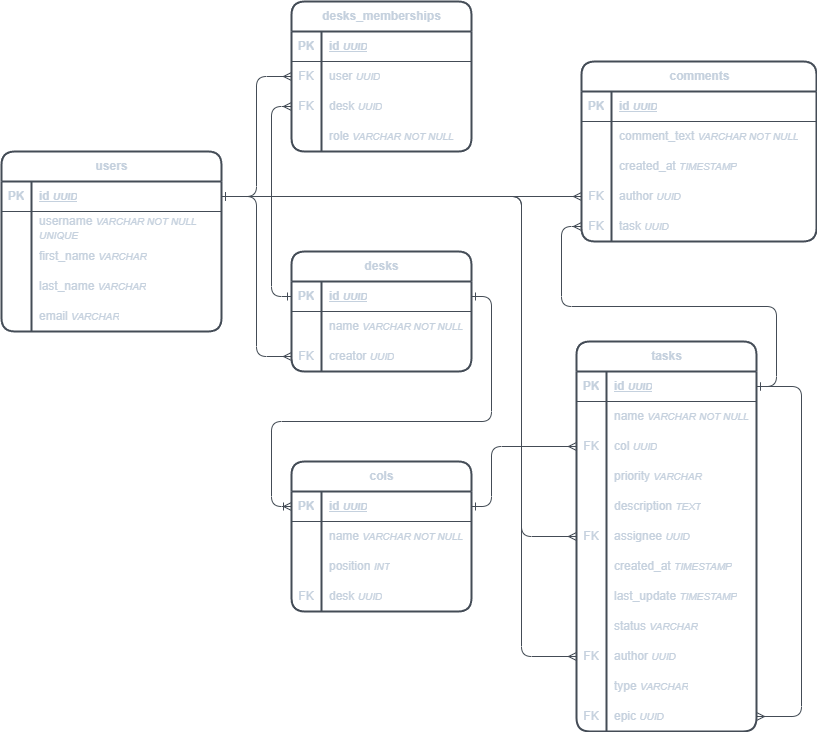

# Task Tracker API
### Итоговый проект по результатам стажировки IT_ONE

---

Задача на стажировку: написать backend часть трекера задач, аналога trello.com. 
Работа должна осуществляться с помощью REST запросов.

---

### Схема базы данных

### Использованные технологии

- Java 17
- Spring Framework (Boot, Web, Data JPA, Security)
- PostgreSQL
- Flyway
- JUnit, Mockito
- Docker
- Swagger
- Gradle
- Mapstruct
- Lombok

(Список зависимостей см. [build.gradle](build.gradle))

### Запуск приложения

Для запуска приложения запустите Docker Desktop и, находясь в директории проекта, используйте команду:

    gradlew bootRun

Все реализованные эндпоинты доступны для просмотра и тестирования в Swagger по ссылке http://localhost:8080/swagger-ui/index.html.

### Планы на развитие

1. ~~Конфигурация Security~~.
2. Javadoc.
3. Подробное описание OpenApi.
4. Оптимизация запросов к базе данных.
5. Загрузка вложений.
6. ~~Дополнительные настройки доски (приватность, участники~~).

### Текущие недоработки

1. Возможно, рекурсивная связь в таблице tasks - не лучшее решение.
2. Недостаточно тестов.
3. ~~Позиционирование колонок на доске (swap позиций двух колонок - не очень хорошее решение, а при удалении колонки позиции не сдвигаются).~~
4. Большинство методов контроллеров требуют deskId в PathVariable, даже если не планируется их использование (возможно стоит исправить).
5. PasswordEncoder не применяется.

